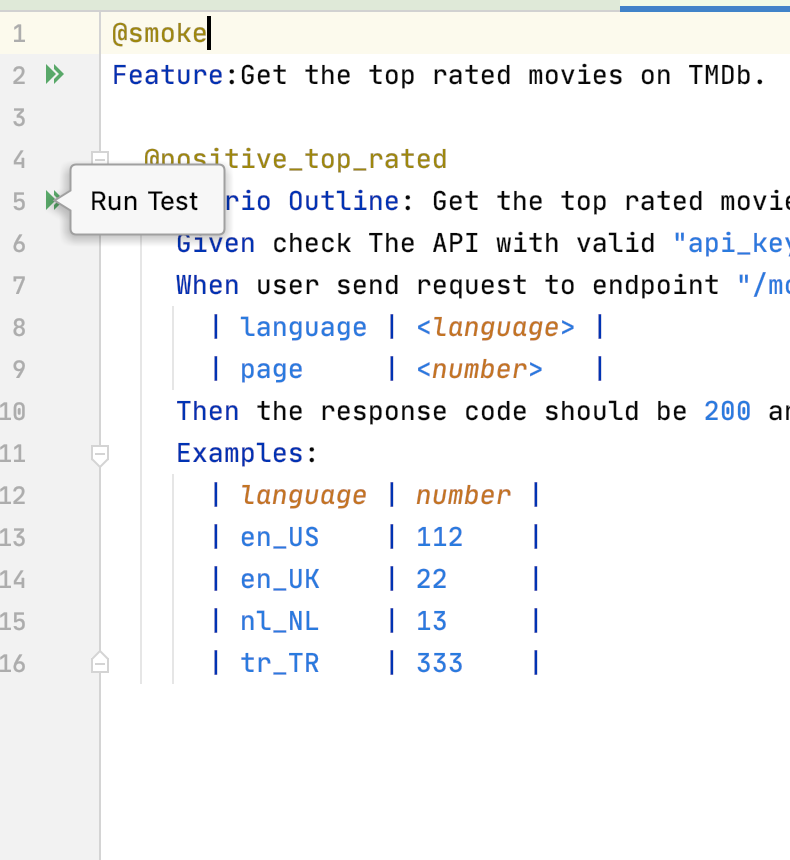
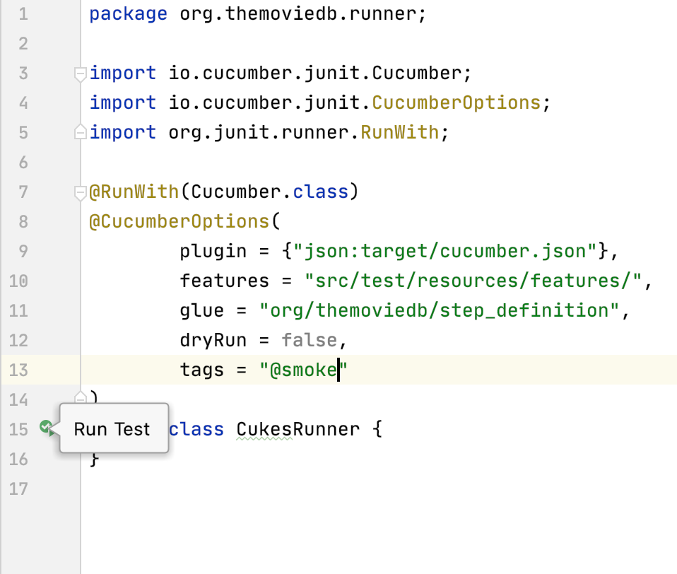
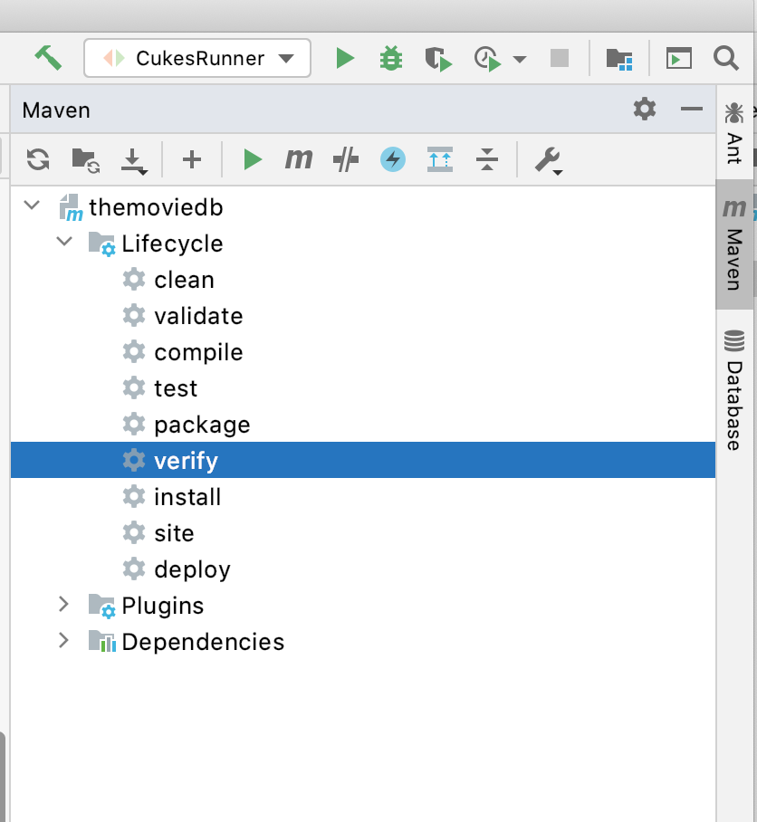

The Movie Database API Tests (Cucumber - Rest Assured) 
========================================
## 

## Report from CI
https://huseyinobul.github.io/themoviedb-api/overview-tags.html
##
This automation suite designed to test the TMDb Api.

* Cucumber (version 5.7.0)
 * Maven (version 3.6.3)
 * Gherkin Language
 * IntelliJ (IDE)
 * Java (version 1.8)
 * Rest Assured (version 4.3.2)
 * Cucumber HTML Reports

 
 ### Project Structure
 * Test Run class  `src/test/java/org/themoviedb/runner`
 * Test step definitions  `src/test/java/org/themoviedb/step_definition`
 * Test Scenarios  `src/test/resources/features`
 * Utilities  `src/test/java/org/themoviedb/utilities`
 * Dependency & Plugin `pom.xml`
 * Important Credential `configuration.properties`

**scenarios include:**
   
   -The project has 4 scenarios that can be located within the feature files: 

    Scenario: Add rating for the movie by movie's id
    Scenario: Add rating for the movie by movie's id with invalid api_key
    Scenario Outline: Get the top rated movies list on TMDb with specific parameters
    Scenario Outline: Get the top rated movies list on TMDb with invalid parameters

    
*Important Note:* scenarios need to have the tag **@smoke** in order to be included in test executions

**Important: This suite should work on both windows and mac platforms however has only been tested on a Mac. If possible please use a Mac to execute the test suite**

In order to execute the automation suite navigate to the Project directory within Terminal/CMD window and run the command: **'mvn clean verify'**.

####Or Run the test cases 
  * feature file ( execute each scenario separately )
 
* CukesRunner class

* mvn ( get html reports)

Scenarios will be executed. **Report html** file can be found under the **'target/cucumber-html-reports/'** folder.

